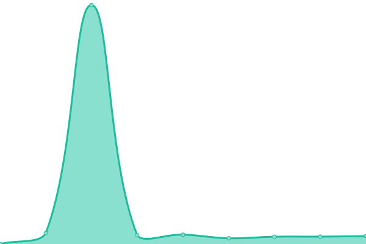

# [📈 Live Status](https://status.tandemchat.ru): <!--live status--> **🟧 Partial outage**

This repository contains the open-source uptime monitor and status page for [TandemChat](https://status.tandemchat.ru), powered by [Upptime](https://github.com/upptime/upptime).

With [Upptime](https://upptime.js.org), you can get your own unlimited and free uptime monitor and status page, powered entirely by a GitHub repository. We use [Issues](https://github.com/TandemChat/status/issues) as incident reports, [Actions](https://github.com/TandemChat/status/actions) as uptime monitors, and [Pages](https://status.tandemchat.ru) for the status page.

<!--start: status pages-->
<!-- This summary is generated by Upptime (https://github.com/upptime/upptime) -->
<!-- Do not edit this manually, your changes will be overwritten -->
<!-- prettier-ignore -->
| URL | Status | History | Response Time | Uptime |
| --- | ------ | ------- | ------------- | ------ |
|  [API](https://app.tandemchat.ru/api) | 🟩 Up | [api.yml](https://github.com/TandemChat/status/commits/HEAD/history/api.yml) | 

 1186ms
     
 | 

<a href="https://status.tandemchat.ru/history/api">100.00%</a>
    

|  [Web](https://app.tandemchat.ru) | 🟩 Up | [web.yml](https://github.com/TandemChat/status/commits/HEAD/history/web.yml) | 

 311ms
     
 | 

<a href="https://status.tandemchat.ru/history/web">100.00%</a>
    

|  [CDN](https://app.tandemchat.ru/autumn) | 🟩 Up | [cdn.yml](https://github.com/TandemChat/status/commits/HEAD/history/cdn.yml) | 

 613ms
     
 | 

<a href="https://status.tandemchat.ru/history/cdn">100.00%</a>
    

|  [Voice](https://vortex.rus-land.fun) | 🟥 Down | [voice.yml](https://github.com/TandemChat/status/commits/HEAD/history/voice.yml) | 

 0ms
     
 | 

<a href="https://status.tandemchat.ru/history/voice">0.00%</a>
    

<!--end: status pages-->

[**Visit our status website →**](https://status.tandemchat.ru)

## 📄 License

- Powered by: [Upptime](https://github.com/upptime/upptime)
- Code: [MIT](./LICENSE) © [Anand Chowdhary](https://anandchowdhary.com), supported by [Pabio](https://pabio.com)
- Data in the `./history` directory: [Open Database License](https://opendatacommons.org/licenses/odbl/1-0/)
